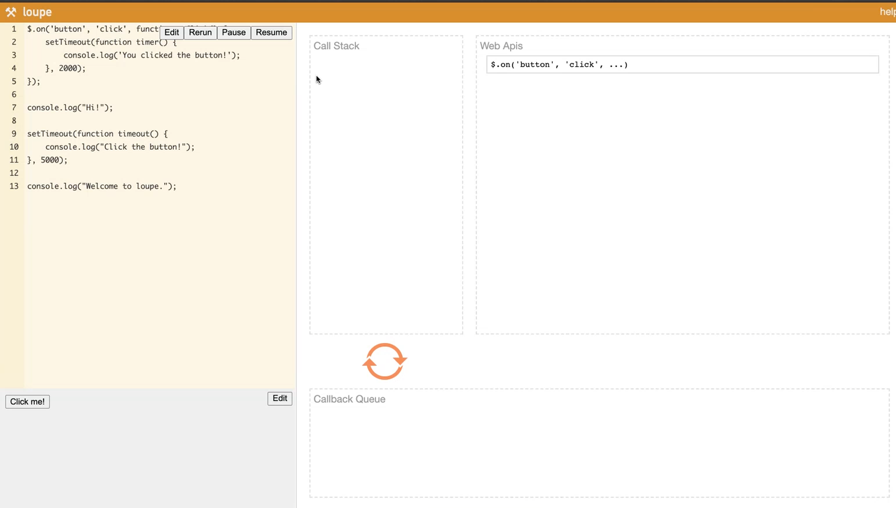

# 课堂笔记

## 1.个人介绍
- linkedin：mason xiong
- Full Stack，三年经验，现在APNIC做，后面会跳到canva
- 提前10分钟～15分钟meeting，会准时下课，讲不完的下节课再讲
- 希望大家能够多提问题
- 希望大家先听，再理解代码的内容，后面再反复的练习
- 每节课后会有一个小的作业，作业可能会给JS多一些，因为面试的时候很多都是考察JS的基础知识

## 2.课程介绍
- 大约10节课的时间，涵盖
  - node.js, API/RESTful API, Express.js(后端框架), MongoDB, Mongoose(ORM), Authentication/Authorisation, Deployment, Docker, Testing
  - 以上真正跟node.js相关的只有：node.js，Express.js
  - 希望大家上完课后，知道后端搭建是怎么完成的

## 3.Background Knowledge
- Front end: how things look：用户交互界面，包括但不限于网页
  - 要求熟悉框架 React，对浏览器兼容性有了解
- Back end: how things work
  - 对前端功能做支持，业务逻辑的实现，其实就是api接口和数据库
  - 还有microservice，如何做缓存，如何部署
- Full stack: both front and back end
  - 整合前端和后端
  - 有整合过的技术栈：
    - 跟node相关的有：MEAN, MERN
      - MEAN: MongoDB Express.js Angular Node.js
      - MERN: MongoDB Express.js React Node.js
- 个人建议前后端都熟悉一下，再选择自己喜欢的
- 从地址栏敲入google.com, 至看到google的界面，中间发生了什么
  - dns解析->通过解析出的ip地址，向服务器发送请求->服务器进行处理，返回数据
  - dns(DOMAIN NAME SYSTEM)解析：涉及到各种缓存
  - 解析出ip地址，进行tcp连接（三次握手）
  - 服务器收到请求：后端需要处理的内容，一般请求带有请求路径，如/search /api
  - 服务器处理请求并返回：后端需要处理的内容，发生在相应逻辑被触发时
    - CSR：客户端渲染，属于前后端分离
    - SSR：服务端渲染
  - 请求方（浏览器）收到返回，
  - 尝试渲染，显示在前端页面
  - 访问google.com，也是有服务器的，只是这个服务器有可能是静态服务器
    - 静态服务器：我们在服务器上放的是静态文件，且文件不会发生变化 
  - 我们在课程中学习的是前后端分离，即后端收到请求后发送数据给前端，然后前端对页面内容进行更新；工作内容为，想要对外部提供api接口，每个接口就是一个服务

## 4.Node.js
- 后端开发的最核心部分
- Node.js是JavaScript的一个运行环境，基于 Chrome V8 engine
- 通过操作系统进入node，其实是进入了一个shell的环境，也叫REPL，即read-eval-print loop，属于language shell，一个JavaScript的bash环境。
- 浏览器里拥有类似环境的是console，同时提供了很多操作系统的node里不具备的接口，比如document.querySelector(), navigator，因为浏览器提供了DOM(Document Object Model)和BOM(Browser Object Model)
- 特性
  - Asynchronous（异步）
    - 同步：我们执行代码，从上到下，就是一个同步，一次只能执行一行代码，需要等待
    - 异步：按照顺序执行代码，但是如果需要调用数据库，则可以设定跳过等待数据库返回的时间，直接触发下一行，等数据库有返回之后，再来处理相应的逻辑操作；等于同时在做多件事情
  - event driven（事件驱动）
    - 解决了异步的一个问题，异步都会有一个call back（告知请求方事件已经完成），然后进行接下来的逻辑处理，我们收到客户端一个请求事件，然后将至处理，就叫event driven
  - Non-blocking
    - blocking：阻塞，基本等同于说要等待，同步的一个操作
    - Non-blocking：不阻塞，异步的一个操作，能够节省更多的资源
  - I/O
    - 最容易造成blocking的，例如对文件数据库的读取
    - node.js中我们使用异步，和event driven把原本阻塞的事件变成非阻塞的事件
  - Fast and scalable
    - 体现在，non-blocking I/O，还体现在开发速度非常快
    - 相对来说，同样资源情况下，更scalable一些
- 主要用来提供一些后端的服务，除此之外，还可以做应用程序的开发，比如VS Code(借助了Electron.js)
- Q:多线程如果同时更新和查看一个元素会导致数据不同步的问题吗？
  - A:首先JavaScript是单线程的，也就是js一次只能做一件事情，如何实现异步，那就要先看node.js的架构
  

  

## 5.Node.js
Node.js就语言本身来讲是单线程，但是通过libuv这类直接跟操作系统交互的lib，最终摆脱了单线程的束缚。
- Application层：等于说是我们写的代码
- Node.js API: 例如我们调用的function，setTimeout()；
- Node.js Bindings: 除了这样的接口，Node.js还提供了一些模块，每个模块可以理解成一个功能，这些模块大部分是用C++ 或者 C，如何将我们写的js转化为C或者C++呢，这就需要Node.js Bindings。Node.js把一些C++或者C的插件/模块整合在一起之后，给他提供了一个绑定，同时对这个绑定提供相应的接口，从而在我们的application中，可以使用js代码直接调用这些接口。
这些模块占格比较大的有：V8，libuv（提供给我们一些操作系统的操作能力），cares（dns解析），HTTP parser（对HTTP请求做出解析），OpenSSL（对信息做加密），zlib（对我们的数据做压缩）
- Q: 线程和进程有什么区别？
  - A: 一个进程可以包含多个线程，一个进程下的所有线程是可以共享资源的（共享相应的数据），对node.js来说是一个所谓的单线程，比如双核CPU，可能最多能创建4个node.js server，因为单线程决定了最多就启动4个。其他非单线程语言，则可以启动无数多个线程，不再受限于内核。
  - 进程是你运行的程序，线程就是这个程序怎么分开运行，比如你的一个chrome页面是一个进程，然后后台cpu分配多个线程进行多个操作，异步就是同时处理多个线程

- 通过以上讨论，对于
  ```js
    console.log('A')
    setTimeout(() => {
        console.log('B');
    }, 3000);
    console.log('C')
  ```
  - 我们就不难得出结果为
  ```
  A
  C
  B
  ``` 
## 5.Event loop
- 什么叫call back: 传参的时候，把function以参数的形式传给另外一个function，而另外一个function会在合适的时候，对它进行调用；简单理解就是   函数调用函数
  - call back, 会产一个问题就是call back hell，会在以后的课程中讲到
  - 例如下面代码
  ```js
    function callback(time) {
    console.log(time);
    }

    function foo(cb) {
        setTimeout(() => {
            cb(new Date());
        }, 1000);
    }
    
    callback(new Date());
    foo(callback);
  ```  
- mac/linux下命令行的操作：
  - `cd <folder name>`：切换到fold name子文件夹
  - `cd ..`：切换回上级菜单
  - `cd ./<folder name>/`：切换到某一文件夹的子文件夹，其中`./`后可以用`tab`来切换目录下的文件夹
  - `node <file name>`：执行js文件
  - `node <绝对路径><文件名>`：使用绝对路径执行js文件
  - `pwd`：获取当前文件夹的绝对路径
  - windows下使用windows terminal，可以使terminal的体验，极其接近mac

- 重要的数据解构：stack和queue
  - stack: first in last out
  - queue: first in first out  

- 结合call back 与 stack，分析下图的代码片段
 
  - 首先看右下角，当最后执行抛出异常时，打印显示的function顺序即为，存在stack里的function顺序，这个我们也叫stack error trace
  - 如果charlie()没有抛出异常，而是调用里setTimeout()，则它会被放入WebAPIs中开始进行倒数
  > eventloop在工作的初级阶段可能并不会被太多的使用到，但是在中后阶段，以及面试阶段会有大量的问题需要考核到 
  - 再看一段演示实例：
   
  - 其中$代表Jquery，帮助开发者快速定位网页上的一个元素，
    - `$.on('button', 'click', function onClick(){});`
      - 快速绑定button，绑定一个click事件，当用户点击时，执行onClick
  
  - 对该段代码，首先执行第一段（$.on）后，会快速的将button与click进行事件绑定，同时，将之放入WebAPIs里，相当于让浏览器进行了事件监听
  - 然后执行第二段(console.log)，第二段代码被放入call stack，并打印 Hi
  - 然后执行了第三段(setTimeout)，第三段代码被放入了WebAPIs里
  - 接着执行，第四段(console.log)，类似于第二段代码，被放入call stack，并打印了 Welcome to loupe
  - 然后等待call back事件reday，第三段代码(timeout())会进入call back queue，因为此时call stack 为空，它将转入call stack并执行，同样类似的，当点击button，click事件被触发，onClick会进入call back queue，如果call stack 为空，它会再 进入call stack，并执行，像这样的过程，即为event loop 
  - event loop在node.js中也是一样的逻辑，只不过 WebAPIs被libuv取代
  - 在single thread里，如果call stack里一直不为空，则call back queue里的function将一直无法进入call stack执行
  - 因此，对于event loop，当call stack里堆积了很多function的时候，如果无法快速清空，会严重导致callback queue里的function无法进入call stack 进行执行
  - 如果call stack一直繁忙，极为可能是我们的io被阻塞了，因此我们代码尽量使用异步代码，使call stack尽量为空；当cpu在执行intensive task的时候，call stack也可能一直繁忙，因此我们不用node.js写一些cpu intenseve的功能，比如分析数据，加解密计算，一般会交给python等完成，node.js我们专注于处理 input/output

  ## node.js的使用场景 
  - 就网站开发的场景，server处理的多为io的请求，例如读取数据库，然后返回，node.js尤为擅长处理io heavy的场景，同时可以进行高并发；因为与前端是同一种语言，打通前后端也是node.js的巨大优势。
  - 因为是single thread，所以在处理cpu intensive的请求是效率不高；因此要么将这类请求外包给其他服务器，要么使用其他语言完成
  - JavaScript为dynamic weakly type，对type的定义过于灵活，所以在大型项目中容易引发潜在问题。这类问题，目前通过typescript可以一定程度上解决这个问题。 
  - 项目中也可能用到 静态文件的扫描工具，比如eslint，来自动化检查代码写的规范与否。
  - 因此，node.js最大的劣势是不好处理cpu intensive的task，但是长于io heavy的场景。

## node.js使用版本的选择
 https://nodejs.org/en/about/releases/
网站中列出了现阶段support的LTS版本，其中Activey与Maintenance的区别是：
- Active表示主动的在进行维护，会主动发现bug与进行性能提升
- Maintenance表示被动的在进行维护
- Current表示目前发布的最新版本，current一般只有一个
- 一般v15这样的单数版本为内测版，v16这样的双数版本为公测版，工作中一定要使用双数版本。
- 现阶段，建议使用actvie LTS版本；该版本写成的代码，2～3年后变为Mantennance状态，在公司里，一般会保留历史版本，不做更新
- 在工作中，如果出现同时使用多个版本的情况，在同一台机器上，我们可以使用node version manager来解决：https://github.com/nvm-sh/nvm

## 课上练习
### 模块概念
我们会创建很多个文件，每个文件即为一个模块；我们每一个js文件都被node包裹成了一个IIFE
- IIFE:immediately invoked function expression
  - 如下代码：
   ```js
    const iife = function () {
      console.log('hello');
    }();
   ```
   写为立即执行形式，即为将函数声明去掉，函数表达式外加括号
   ```js
   (function () {
      console.log('hello');
    })();
   ```
   - 立即执行函数的 好处是，内部变量作用域仅限于该函数，也不会跟外部变量进行相互污染 
     - 例如引用的外部文件将a赋值了1，即  
       `window.a = 1;`   
       而我们本地定义了a为true，即  
       `window.a = true;`    
       则变量因为外部文件受到了污染，这种篡改很难被发现
    - VS Code中可以设定snippets，然后敲`CLG`直接输出console.log
    - VS Code中，选中一个变量，同时使用`command + D`，就会选中所有的同名项 
    - VS Code中，讲该行上下移动，为`option + 上/下`
    - VS Code中，快速复制本行到上下行，为`option + shift + 上/下`
     
- 首先我们写一个IIFE，然后完成如下功能：打印1 2 3 4 5...
 ```js
  const moduleA = { exports: {} };

  (function (module) {
    let count = 0;

    function increaseCount() {
      count++;
    }

    function getCount() {
      return count;
    }

    module.exports = { increaseCount, getCount };

  })(moduleA);

  setInterval(() => {
    moduleA.exports.increaseCount();
    console.log(moduleA.exports.getCount());
  }, 1000);
```
- 其中的IIFE，可以理解成我们单独写了一个js文件(count.js)，即count模块：
  ```js
  let count = 0;
  console.log('count module loaded');

  function increaseCount() {
    count++;
  }

  function getCount() {
    return count;
  }

  module.exports = { increaseCount, getCount };
  ```
  那最开始的代码，可以修改为：
  ```js
  const { increaseCount, getCount } = require('./count');

  setInterval(() => {
    increaseCount();
    console.log(getCount());
  }, 1000);
  ```
  注意导入（require）和导出（exports）
  这里需要注意的是，如果`count.js`中，没有做导出，即如果没有，或部分缺少  
  ```js
  module.exports = { increaseCount, getCount };
  ```
  则，该模块在上面的代码中调用会报错
 
 