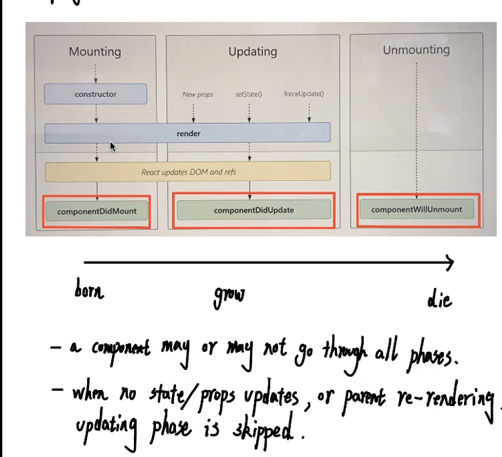

# Lecture 16 React-3
## 1. Derive state from prev state
### 1.1 setState is scheduled 
- React不会及时执行set state，他会挑选一个时机一起setstate
- 提升性能
### 1.2 In each component rendering, state values are resolved as 'constants'. which is snapshot
 - 描述一瞬间的状态
 - 结果是每次onAddThreeClick都只会加1
   - 每次addOneToCount拿到的count都是0  - setState 是异步的
   - react执行到setstate是会直接放到heap里等待合适的时机执行，此时count指向当下count的值也就是0
 ```js 
 import {useState} from 'react';

 const Sandbox = () => {
    const [count, setCount] = useState(0);
    const addOneToCount = () => setCount(count + 1);

    //const addOneToCount = () => setCount((prevState) => prevState + 1);
    // set states are scheduled and executed asynchronously
    // resolve state as a constant
    const onAddThreeClick = () => {
        addOneToCount(); // count = 0 => count + 1
        addOneToCount(); // count = 0 => count + 1
        addOneToCount(); // count = 0 => count + 1
    };

    return (
        <div>
            <h1>{count}</h1>
            <button onClick={onAddThreeClick}>Add 3</button>
        </div>
    );
}

  export default Sandbox;
```
- 用prevstate可以解决这个问题，结果是每次会加三
  - count是我们给的值
  - prevState是react给的值，能保证是最新的
 ```js 
 import {useState} from 'react';

 const Sandbox = () => {
    const [count, setCount] = useState(0);
    //const addOneToCount = () => setCount(count + 1);

    const addOneToCount = () => setCount((prevState) => prevState + 1);
    // set states are scheduled and executed asynchronously
    // resolve state as a constant
    const onAddThreeClick = () => {
        addOneToCount(); // count = 0 => count + 1
        addOneToCount(); // count = 0 => count + 1
        addOneToCount(); // count = 0 => count + 1
    };

    return (
        <div>
            <h1>{count}</h1>
            <button onClick={onAddThreeClick}>Add 3</button>
        </div>
    );
}

  export default Sandbox;
```
## 2. Derive state from props
### 2.1 Example about change a little button
- update title不起效
```js
  //Expenses.js
  import './Expenses.css';
  import ExpenseItem from "./expenseItem/ExpenseItem";

  const Expenses = (props) => {
    const expenses = props.expenses;
    const [title, setTitle] = useState(expenses[0].title);
    const onTitleChangeClick = () => {
         setTitle('Update from Expenses');
     };

    return (
        <div className="expenses">
          <button onClick={onTitleChangeClick}>update title<button>
            {expenses.map(expense => {
                return (
                    <ExpenseItem
                        key={expense.id}
                        title={expense.title}
                        date={expense.date}
                        amount={expense.amount}/>
                );
            })}
        </div>
    );
}
export default Expenses;
```    
- change title 起效
```js
  //ExpenseItem.js
  import './ExpenseItem.css';
  import ExpenseDate from './expenseDate/ExpenseDate';
  import {useState} from 'react';

  const ExpenseItem = (props) => {
    // local state
     const [title, setTitle] = useState(props.title); // derive state from props 只会执行一次，后面props在传进来任何东西都会被忽视
     const onChangeTitleButtonClick = () => {
         setTitle('Updated from ExpenseItem');
     };

    return (
        <div className='expense-item'>
            <ExpenseDate date={props.date}/>
            <div className='expense-item__description'>
                <h2>{title}</h2> {/*这里调用的是state，不是props*/}
                <div className='expense-item__price'>{props.amount}</div>
            </div>
            <button onClick={onChangeTitleButtonClick}>Change title</button>
        </div>
    );
}

export default ExpenseItem;
```

### 2.2 summary
- change of source 要对应
  - 当change of source 是props时，就要调用props
  - 当change of source 是state时，就要调用state
## 3. Component lifecycle
### 3.1 class componet
 - an alternative way to write componet 
### 3.2 Compare
  - 16.8前，class component用来管理state，functional componet是stateless 
  - 16.8后，引入hook
```js
//class component
import {Component} from 'react';
import User from './User';

import classes from './Users.module.css';

class Users extends Component {
  constructor(props) {
    super(props);
    this.state = {
      showUsers: true
    };
  }

  toggleUsersHandler() {
    this.setState((prevState) => {
      return {
        showUsers: !prevState.showUsers
      };
    });
  }

  render() {

    return (
        <div className={classes.users}>
          <button onClick={this.toggleUsersHandler.bind(this)}>
            {this.state.showUsers ? 'Hide' : 'Show'} Users
          </button>
          {this.state.showUsers ? <ul>
            {this.props.users.map((user) => (
                <User key={user.id} name={user.name} />
            ))}
          </ul> : null}
        </div>
    );
  }
}

// functional component

// const Users = () => {
//   const [showUsers, setShowUsers] = useState(true);
//
//   const toggleUsersHandler = () => {
//     setShowUsers((curState) => !curState);
//   };
//
//   const usersList = (
//     <ul>
//       {DUMMY_USERS.map((user) => (
//         <User key={user.id} name={user.name} />
//       ))}
//     </ul>
//   );
//
//   return (
//     <div className={classes.users}>
//       <button onClick={toggleUsersHandler}>
//         {showUsers ? 'Hide' : 'Show'} Users
//       </button>
//       {showUsers && usersList}
//     </div>
//   );
// };

export default Users;
```
### 3.3 lifecycle


## 4. Render multiple components from an array
 - 用array.map返回一组component
 - react会把新的item渲染到最底下
   - 如何提高性能
     - 在map里的element加一个key
```js
  //Expenses.js
  import './Expenses.css';
  import ExpenseItem from "./expenseItem/ExpenseItem";

  const Expenses = (props) => {
    const expenses = props.expenses;
    
    return (
        <div className="expenses">
            {expenses.map(expense => {
                return (
                    <ExpenseItem
                        key={expense.id}
                        title={expense.title}
                        date={expense.date}
                        amount={expense.amount}/>
                );
            })}
        </div>
    );
}
export default Expenses;
```    
## 5 Project2
 - 常考的code test，网上有很多example
 - 下节课说怎么跟后端互动
