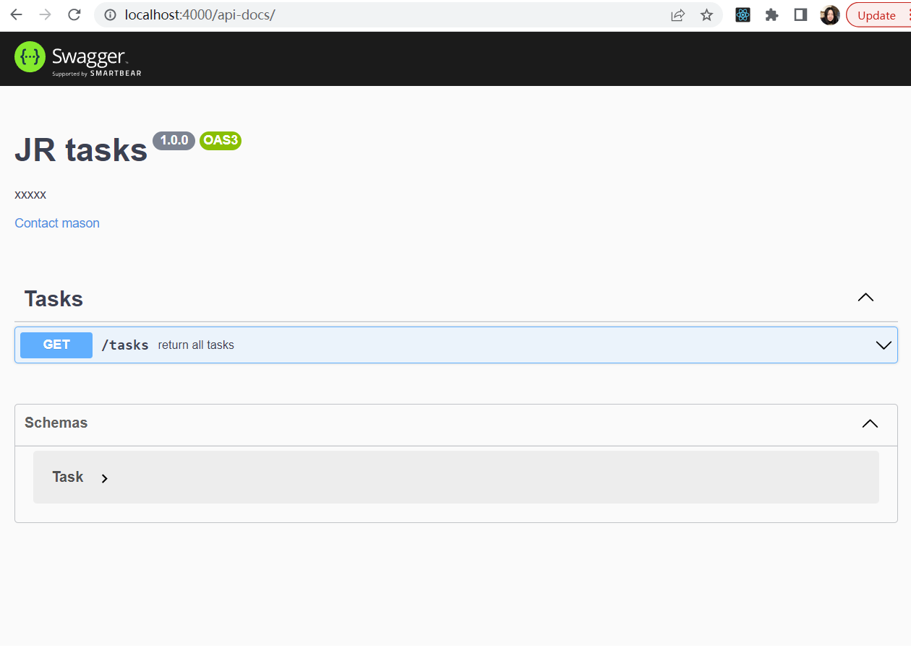

# Lecture 21 拆分API&Swagger&MongoDB

## 21.1 拆分api 

- Nodejs常见项目拆分结构
```js
-- package.json
-- package-lock.json
-- src
  |-- index.js 入口文件(server.js.app.js)
  |-- routes
    |-- tasks.js(taskRouter)(task.route.js)
    |-- users.js(userRouter)
    |-- index.js(把上面所有的router导入进来，再做一个统一的导出
  |-- controllers (逻辑处理部分）
    |-- tasks.js(taskController)(task.controller.js)
    |-- users.js
  |--models
    |--tasks.js(Task.js) 数据库中Task这个数据的格式设计 -ORM （object relational mapping），跟数据库交互
  |--middleware
    |--error-middleware
      |-- xxxErrorHandler.js
    |-- authGuard
    |-- cors
  |-- utils (Helper function, shared function, db)
  |-- db
  |-- config 项目配置（环境变量的处理）
```
- 上述拆分方向有时会把routes和controller合并，或者增加services文件夹，来应对更加复杂的逻辑： 
- 第二种拆分方向
```js
src
- users
  -- user.controller.js
  -- user.model.js
- tasks
```
- 拆分好的文件库：https://github.com/LazeBear/jr-todos-api-walkthrough

## 21.2 Other Useful Packages
- cors
  - 提供 Connect/Express 中间件, 解决跨域问题
```js
const cors = require('cors')
app.use(cors())
```
- morgan
  - 输出请求日志
```js
const morgan = require('morgan');
app.use(morgan('dev'));
```
- dotenv
  - 配置环境变量
```js
//index.js 中
require('dotenv').config();
PORT = process.env.PORT || 3000;
//.env 文件中
PORT=4000
```

- helmet
  - Helmet 通过设置各种 HTTP Header来帮助保护Express
```js
const helmet = require('helmet');
app.use(helmet());
```
- winston
  - winston 中的日志记录级别，所有级别的严重性按数字顺序从最重要到最不重要
```js
  - const levels = {
    error: 0,
    warn: 1,
    info: 2,
    http: 3,
    verbose: 4,
    debug: 5,
    silly: 6
};
```

  - implement
```js
 //in utils/logger.js
const winston = require('winston');

const logger = winston.createLogger({
    level:process.env.LOGGER_LEVEL || 'info', //输出某个level以上的日志

    format:winston.format.combine( //日志打印格式
        winston.format.colorize(),
        winston.format.timestamp({
            format:'YYY-MM-DD HH:mm:ss',
        }),
        winston.format.printf(
            (info) => `${info.timestamp} ${info.level}: ${info.message}`
        )
    ),
    transports:[new winston.transports.Console()],
});

module.exports = logger;

//in .env
LOGGER_LEVEL=debug
//then we can use:
logger.info(`Example app listening at http://localhost:${PORT}`);
  instead of
console.log(`Example app listening at http://localhost:${PORT}`);
```

## 21.3 swagger
- 可交互的API文档
- 安装
  - npm install swagger-jsdoc 写好的文本转化成html页面
  - npm install swagger-ui-express 把swagger页面注入到express server中，从而通过url访问该页面
- implement
```js
//in index.js
const swaggerUI = require('swagger-ui-express');
const swaggerJsDoc = require('./utils/swagger');
app.use('/api-docs',swaggerUI.serve,swaggerUI.setup(swaggerJsDoc));

//in utiles/swagger.js
const swaggerJsDoc = require('swagger-jsdoc');

module.exports = swaggerJsDoc({
    definition: {
        openapi: '3.0.0', //保证查文档时的版本和此版本保持一致
        info:{
            title:'JR tasks',
            version:'1.0.0',
            contact:{
                name:'mason',
                email:'example.com',
            },
            description:'xxxxx',
        },
    },
    apis:['src/controllers/*.js'], //在src/controllers下的所有js文件都有可能出现swaggerDoc文档

});

//in controllers/task.js 在对应的function上来写，很容易在修改API时修改文档

//yaml

/**
 * @swagger
 * components: 创建变量 components
 *   schemas: 数据类型
 *     Task:  
 *       type: Object 
 *       required:  必要的property
 *         - description
 *       properties: 其他properties
 *         id:
 *           type: string  
 *           description: auto generate unique identifier
 *         description:
 *           type: string
 *           description: description of the task
 *         done:
 *           type: boolean
 *           description: status of the task
 *       example: 示例
 *         id: 1
 *         description: task 1
 *         done: false
 */
/**
 * @swagger
 * /tasks:   路径
 *   get:     Method
 *     summary: return all tasks  对请求的描述
 *     tags: [Tasks]      最上方的大标签
 *     parameters:        请求接收的参数
 *       - name: description    parameter的名字，支持多个参数
 *         in: query      放在query里
 *         description: filter tasks by description  对参数的描述
 *         schema:       参数类型
 *           type: string
 *     responses:
 *       200:        回复结果
 *         description: array of tasks    回复描述
 *         content:     回复内容
 *           application/json:    
 *             schema:      回复类型
 *               type: array
 *               items:
 *                 $ref: '#/components/schemas/Task' 引用单独申明的component
 */
```
 

## 21.4 数据库类型
- SQL structured qurey language
关系型数据库
- No SQL / not only sql
非关系数据库 

- SQL sample
  - MySQL
  - PostgresQL
  - SQLite

- non-SQL sample
  - document-orientated -> mongodb 数据库中的数据以一个个的document的形式存储
  - key-value -> redis
  - graph-oriented -> neo4j
  - column-family -> cassandra
  
## 21.5 MongoDB
- humongous 庞大的
- No-SQL 非关系型数据库
- Stores data in JSON-like documents
  - _id: ObjectId 
  - BSON - Binary JSON
- Flexibility and schemaless
  - 可以处理数据格式不一致（schemaless）的数据,如下
```js
[
  {
    _id: xxx1,
    name:yyy，
    age:10,
    dob:xxxx
  },
  {
    _id:xxx2,
    username:yyy
   }
]
```

- schemaless 的优势：数据容易迭代和更新,可以很容易地修改数据的格式，但修改数据时会出现修改前后数据不一致的问题，这时候需要写一个script进行计算
- schemaless 的劣势：无法方便地遍历数组，需要进行各种判断
#### 21.5.1 Structure Terminology
- Database Server中有许多数据库（Database1，Database2），数据库中有许多的collection（User collection、Task collection），collection中有多个document，同样的类型的document会组成一个collection，document中有许多fields
- document 格式：`{_id:xxx,name:"mason"}`
- client与server连接
  - cli - mongo shell
  - gui - mongo compass
  - script - mongo-client,mongoose
- 命令行输入`mongo`，如果server已经打开，则会显示连接成功
#### 21.5.2 Document and data types
- _id: 自动生成，不指定类型，默认用 ObjectID
- Name: Text(string)
- Hobbies:array(array of string)
- Address: object(embeded document)
- Wishes: array(array of documents)
- 其他常见data类型：
  - Boolean
  - Number(int32,int64,float)
  - Date(ISODate,timestamp)
